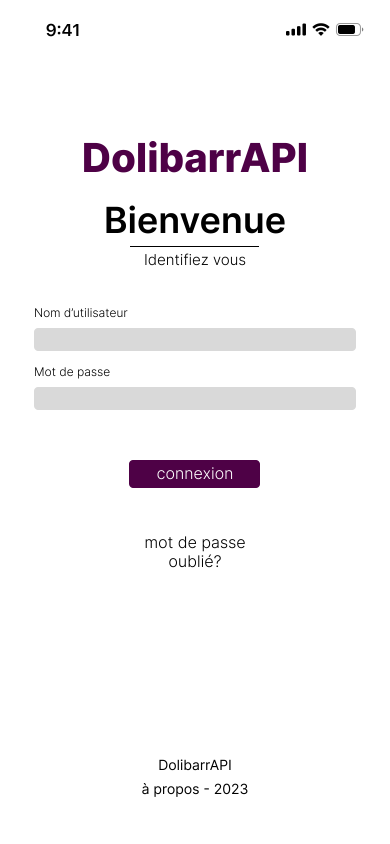
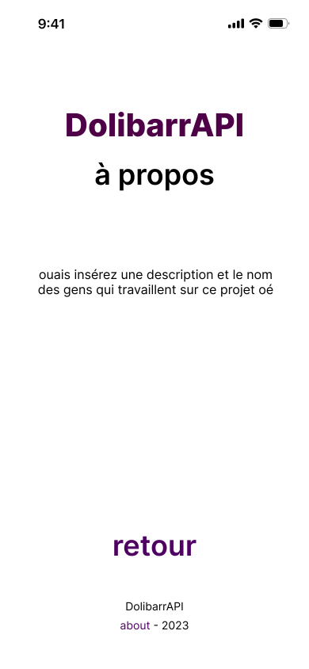

# ToDo :
- ⚠⚠⚠ Mettre les fonctions utile dans un fichier type [main.js](js/main.js) ⚠⚠⚠

- ⚠⚠⚠ L'ordre d'insertion des scripts dans la page sera toujours le même :
    - cookie.js --------------|
    - preload.js -------------| <== Tête de page
    - main.js ----------------| <== Fin de page
    - [SCRIPT_SPECIAL].js --|

- Pages à faire en priorité :
    - Création de Note de frais - [Semi-fait]
    - Création de facture
    - Effectuer un remboursement - [Semi-fait]

# Notes :
- ! Ne plus toucher au fichier [login](js/login.js) !
- ! Certain paramètres doivent encoder en URI avant de les envoyés à l'API

# Maquettes :
| index | about |
| :---: | :---: |
 | 